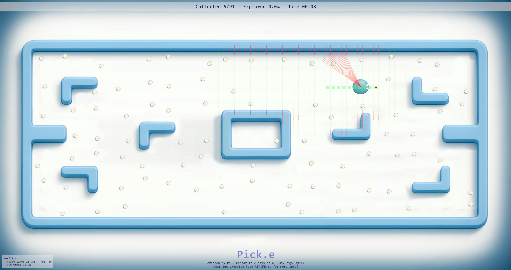

# Pick.e

_A 2-day Rust + Bevy + Rapier learning project by Paul Connor_

---

## Purpose

Hello! **Pick.e** is a small testbed I created to learn **Rust**, **Bevy (ECS)**, and **Rapier (2D physics/raycasting)** from scratch over a single 2-day weekend.  
The goal was to rapidly create a minimal robotics-themed simulation loop and UI, then use it to explore simplified robot LiDAR sensor-driven mapping and navigation.

---

## Try it

Run **Pick.e** in your browser:
<a href="https://paulwconnor-ai.github.io/pick-e" target="_blank" rel="noopener noreferrer">https://paulwconnor-ai.github.io/pick-e</a>

### Controls

- Toggle Auto-Nav (on by default): M
- Move: W/A/S/D (forwards, back, turn-left, turn-right)

  

---

## Current Features

- Top-down 2D map with walkable and blocked areas (collision inferred from beauty texture)
- Raycast-based simulated LiDAR sensor
- Real-time occupancy-grid-based mapping from LiDAR
- Autonomous nav mode using frontier exploration
- Pickups that disappear when touched
- UI overlay with stats and performance info
- Web demo hosted via GitHub Pages
- Optional Manual WASD robot control (press M to toggle auto-nav, WASD to control)

---

## Planned Features

- Further develop navigation to allow all pickups to be collected
- Evaluate performance, simulation determinism, and modularity to prepare for scaling up to multi-agent testing
- Consider adding further simple metrics to track navigation efficiency, collisions, mapping coverage, and pickup success rate

---

## Known limitations

- LiDAR is idealised (no noise model yet).
- Frontier planner is intentionally minimal.
- Path traversal code needs further work - poor Pick.e sometimes gets stuck!
- Deterministic (seeded) mode not yet enabled.
- Its a simplistic 2D simulation - not intended a basis for a production tool.

---

## Architecture at a Glance

- **ECS** (Bevy): game loop, scheduling, systems
- **Physics/Raycast** (Rapier): LiDAR beams, simple collisions
- **Robot Core**: `CmdVel` (intent), `DiffDrive` (motion), `Pose`
- **Perception**: LiDAR system → hit points → occupancy grid update
- **Mapping/Memory**: occupancy grid (derived from LiDAR data)
- **Auto-Nav**: frontier exploration → path plan → follow
- **UI**: stats overlay (perf + simple sim metrics)

---

## Scope and authorship

This was an intentionally collaborative, time-boxed learning project:

- **Paul Connor (me):** defined the project structure and learning goals; specified all behaviours and systems; integrated and iterated on every change; tested and debugged the simulation end-to-end. I approached it from a simulation and robotics design perspective, drawing on 20+ years of professional experience with C++/C#-based engines (including Unreal, Unity, and proprietary ECS-based engines).

- **ChatGPT:** assisted by producing idiomatic Rust/Bevy code to match my specifications, helping me rapidly explore engine patterns, Bevy’s ECS model, and Rust conventions. This allowed me to focus on architecture, data flow, and robotics logic while learning the stack efficiently.

The project reflects my own architecture and goals, implemented with assistive tooling to accelerate fluency in a new ecosystem.

---

## Tech stack

- **Rust**
- **Bevy** — Entity Component System game engine
- **Rapier** — 2D physics and raycasting
- **WebAssembly (WASM)** — for browser builds

---

## License

Apache-2.0
